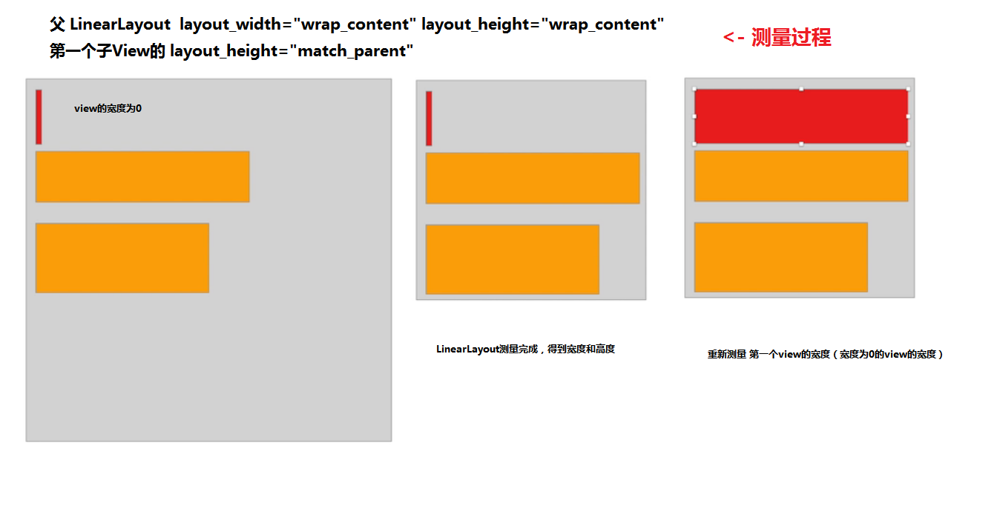

<font size=4 color=#D2691E> 谈一谈Measure 2019年05月10日 </font>

### 首先先抛出几个问题。
* 1.为什么布局过程分为测量和绘制两个流程呢呢？
* 2.layout_大头的属性是父View用呢，还是子View用呢，还是都用呢？
* 3.resoveSize和resolveSizeAndState是修正结果，为什么要修正结果呢？
* 4.onLayout中的 int left, int top, int right, int bottom 四个参数，我们什么时候会用到呢？
    ```java
    protected void onLayout(boolean changed, int left, int top, int right, int bottom) {

    }
    ```

### 首先我先说一下我对测量过程的理解。
```java
protected void onMeasure(int widthMeasureSpec, int heightMeasureSpec) {

}
```
比如说，这是一个ViewGroup A 的OnMeasure方法，其中 widthMeasureSpec 和 heightMeasureSpec 为ViewGroup A 的父级对A的测量要求。 A会根据自己父级对自己的测量要求，以及开发者指定的自己的child在xml里面要求，对自己的child进行测量。

* 1.取出child的layout_打头的属性。
* 2.根据child的layout_大头的属性，结合ViewGroup A 的可用空间，生成 MeasureSpec。
* 3.拿着上一步生成的 MeasureSpec ，调用 child.measure(childWidthMeasureSpec, childHeightMeasureSpec) 来测量child。
* 4.拿着上一步测量的结果，重新计算自己的可用空间，接着测量下一个child。
* 5.测量完成所有的child以后，计算出自己的高度和宽度，调用setMeasuredDimension(int measuredWidth, int measuredHeight)

### 解决一下一开始，提出的问题：
* 1.为什么布局过程分为测量和绘制两个流程呢呢？<br>
   答：因为测量过程很复杂，如果写在一块会变得更复杂，所以分为两个步骤。举个复杂的例子。
   
* 2.layout_大头的属性是父View用呢，还是子View用呢，还是都用呢？<br>
   答：是父View用，父View获取child layout_大头的属性，结合ViewGroup A 的可用空间，生成 MeasureSpec。所以子View在自己的onMeasure方法中，不会再获取自己 layout_大头的属性了，直接取 MeasureSpec里面的Mode和Size即可。
* 3.resoveSize和resolveSizeAndState是修正结果，为什么要修正结果呢？<br>
   答：查看LinearLayout和FrameLayout的源码，发现在onMeasure中，都有调用 resolveSizeAndState 的方法。首先看一下这个方法的源码。
   ```java
    public static int resolveSizeAndState(int size, int measureSpec, int childMeasuredState) {
        final int specMode = MeasureSpec.getMode(measureSpec);
        final int specSize = MeasureSpec.getSize(measureSpec);
        final int result;
        switch (specMode) {
            case MeasureSpec.AT_MOST:
                if (specSize < size) {
                    result = specSize | MEASURED_STATE_TOO_SMALL;
                } else {
                    result = size;
                }
                break;
            case MeasureSpec.EXACTLY:
                result = specSize;
                break;
            case MeasureSpec.UNSPECIFIED:
            default:
                result = size;
        }
        return result | (childMeasuredState & MEASURED_STATE_MASK);
    }
   ```
   ```java
   protected void onMeasure(int widthMeasureSpec, int heightMeasureSpec) {
   }
   ```
   我的理解是，调用resolveSizeAndState是为了让我们最终测量的结果，要满足父级传给我们的widthMeasureSpec和heightMeasureSpec的限制。<br>
   比如：LinearLayout的heightMeasureSpec中Mode为AT_MOST，Size为500。但是，我们测量完子View得到的高度为1000。这时候我们就得需要调用resolveSizeAndState来修正一下我们测量的值了。

* 4.onLayout中的 int left, int top, int right, int bottom 四个参数，我们什么时候会用到呢？<br>
  答：目前没有找到答案，作为一个待解决问题喽。

### 再简单说一下layout过程，因为layout的过程比较简单。
* 1.测量完成，会调用View的layout方法。
* 2.layout方法中，会将执行如下代码,会将mLeft，mTop，mRight，mBottom赋值,我们就可以调用getWidth(),getHeight()获取View的宽度和高度了。
    ```java
    mLeft = left;
    mTop = top;
    mRight = right;
    mBottom = bottom;

    public final int getWidth() {
        return mRight - mLeft;
    }
    ```

* 3.layout方法中，会调用onLayout方法,onLayout方法中，我们会layout自己的child。
* 4.layout过程完成，就是绘制过程了。

### 再研究 ？
从安卓源码中，并没有发现 measure，layout,draw 的调用。至于谁调用的，什么时候调用的，以后再研究了。
   
